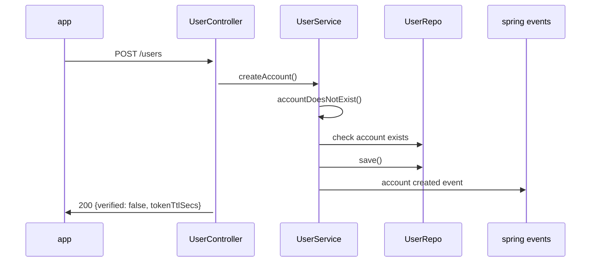

# Skillspro backend

## User creation

```mermaid
sequenceDiagram
    participant app as app
    participant uctrl as UserController
    participant usvc as UserService
    participant urepo as UserRepo
    participant evt as spring events
    app->>+uctrl: POST /users
    uctrl->>usvc: createAccount()
    usvc->>usvc: accountDoesNotExist()
    usvc->>urepo: check account exists
    usvc->>urepo: save()
    usvc->>evt: account created event
    uctrl->>app: 200 {verified: false, tokenTtlSecs}
```