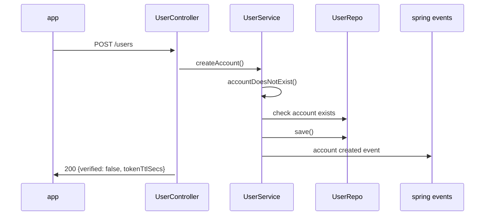
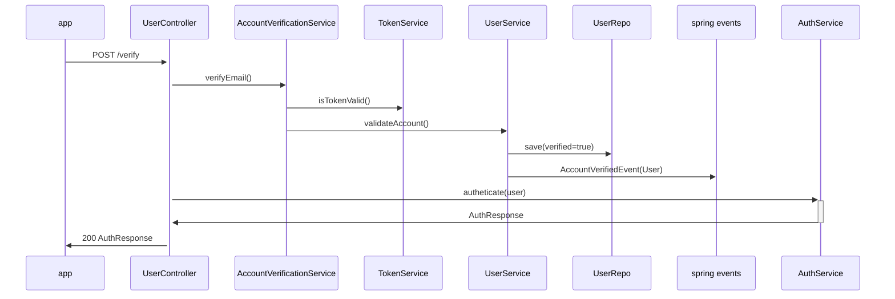
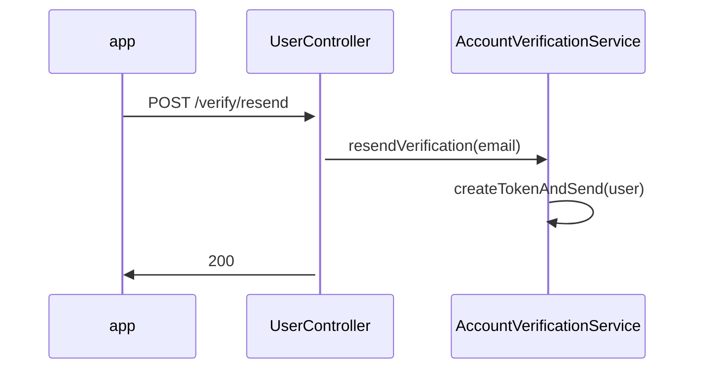

# Skillspro backend

## User creation

```mermaid
sequenceDiagram
    participant app as app
    participant uctrl as UserController
    participant usvc as UserService
    participant urepo as UserRepo
    participant evt as spring events
    app->>+uctrl: POST /users
    uctrl->>usvc: createAccount()
    usvc->>usvc: accountDoesNotExist()
    usvc->>urepo: check account exists
    usvc->>urepo: save()
    usvc->>evt: account created event
    uctrl->>app: 200 {verified: false, tokenTtlSecs}
```
## Account verification

```mermaid
sequenceDiagram
    participant app as app
    participant uctrl as UserController
    participant vs as AccountVerificationService
    participant ts as TokenService
    participant us as UserService
    participant urepo as UserRepo
    participant evt as spring events
    participant auth as AuthService
    app->>+uctrl: POST /verify
    uctrl->>vs: verifyEmail()
    vs->>ts: isTokenValid()
    vs->>us: validateAccount()
    us->>urepo: save(verified=true)
    us->>evt: AccountVerifiedEvent(User)
    uctrl->>+auth: autheticate(user)
    auth->>-uctrl: AuthResponse
    uctrl->>app: 200 AuthResponse
```

## resend verification token

```mermaid
sequenceDiagram
    participant app as app
    participant uctrl as UserController
    participant vs as AccountVerificationService
    app->>+uctrl: POST /verify/resend
    uctrl->>vs: resendVerification(email)
    vs->>vs: createTokenAndSend(user)
    uctrl->>app: 200
```